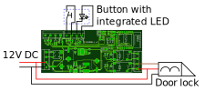

# Used Hardware
* One bell button with integrated 12V LED
* One door with an automatic lock
* One FRITZ!Box 7590 and some FRITZ!Fons (C5 and C6)
* Optional: Reolink RLC-410 ip cam

# Wiring diagram


# Software configuration
Requested functionality
* When the bell button is pressed all associated phones shall ring and a MQTT trigger shall be send to Home Assistant
* If the `Open` button is pressed on one of the phones the door shall unlock for a few seconds
* It should be possible to unlock the door for a few seconds from Home Assistant
* It should be possible to mute the bell button from Home Assistant

Required configuration
```
#define DEVICE_CONFIG (SIP1_ENABLED|SIPLOCK_ENABLED|MQTTLOCK_ENABLED|MQTTBELL1_ENABLED|MQTTBUTTON1_ENABLED)
```

# FRITZ!Box setup
* Add a door intercom system as new telephony device
* Select `LAN / Wi-Fi (IP door intercom system)` as connection
* Define a username and password. Must be identical to the config defines `SIP_USER` and `SIP_PASS`!
* Configure one bell button and set phone number to `11` = `SIP_DIAL_NR1`
* Configure `5` = `SIP_DIAL_DIGIT` as character for door opener
* Select the phone(s) which should ring in case of a button press event
* Optional: Add live picture `http://ip.of.your.cam/cgi-bin/api.cgi?cmd=Snap&channel=0&rs=0000&user=****&password=****&width=480&height=360`

# Home Assistant setup
* If the MQTT connection is setup correctly the door bell is automatically added via MQTT discovery
* The door bell can be found as a device named `HOSTNAME` under Settings->Mosquitto broker
* The MQTT device should have two entities (`Door` and `Button 1`) and one trigger (`Button 1 pressed`)
