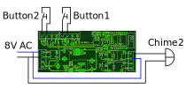

# Used Hardware
* Two bell buttons
* One chime
* One FRITZ!Box 7590 and some FRITZ!Fons (C5 and C6)

# Wiring diagram


# Software configuration
Requested functionality
* When the bell button 1 is pressed all associated phones shall ring and a MQTT trigger shall be send to Home Assistant
* When the bell button 2 is pressed all associated phones shall ring and a MQTT trigger shall be send to Home Assistant
* When the bell button 2 is pressed the chime shall ring
* It should be possible to mute all bell buttons from Home Assistant

Required configuration
```
#define DEVICE_CONFIG (SIP1_ENABLED|SIP2_ENABLED|CHIME2_ENABLED|MQTTBELL1_ENABLED|MQTTBELL2_ENABLED|MQTTBUTTON1_ENABLED|MQTTBUTTON2_ENABLED)
```

# FRITZ!Box setup
* Add a door intercom system as new telephony device
* Select `LAN / Wi-Fi (IP door intercom system)` as connection
* Define a username and password. Must be identical to the config defines `SIP_USER` and `SIP_PASS`!
* Configure two bell buttons and set phone number to `11` = `SIP_DIAL_NR1` for the first and `12` = `SIP_DIAL_NR2` for the second button
* Select the phone(s) which should ring in case of the button press events

# Home Assistant setup
* If the MQTT connection is setup correctly the door bell is automatically added via MQTT discovery
* The door bell can be found as a device named `HOSTNAME` under Settings->Mosquitto broker
* The MQTT device should have two entities (`Button 1` and `Button 2`) and two triggers (`Button 1 pressed` and `Button 2 pressed`)
